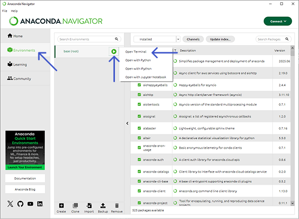

# NREL Sectral Efficiency and Tandem calculator
This is a wrapper around the [`NREL SE and Tandem` package](https://github.com/NREL/SE-and-Tandems) designed for easier installation and use. The package is included as a [Git submodule](https://git-scm.com/book/en/v2/Git-Tools-Submodules).


## Installation

### Anaconda (recommended)

0. Install [Anaconda](https://www.anaconda.com/download) if it isn't already.

1. Download the [`nrel_se_and_tandems.yml`](nrel_se_and_tandems.yml) file.

    Look for the  icon on the right of the page.

2. Start `Anaconda Navigator`.

3. Open a `conda` terminal.
    1. Click on the `Environments` tab.
    2. Click on the play button of the active environment (it doesn't matter which environment is active).
    3. Click `Terminal`

    

4. In the prompt, run
    ```bash
    conda tos accept --override-channels --channel https://repo.anaconda.com/pkgs/r --channel https://repo.anaconda.com/pkgs/msys2 & exit
    ```
    This accepts the terms of service for the required package repositories.

5. Click `Import` at the bottom of the `Environments` tab and select the [`nrel_se_and_tandems.yml`] file you downloaded in step 1.

    You can change the name of the environemnt if you want.

    It will take a few minutes to complete the import process.

6. Ensure the new environemnt is active. 

    The active environment is indicated by a green line to the left of the name adn the play button to the right.

    Click on an environment to activate it.

7. In the `Home` tab launch `JupyterLab`. Follow the [How to use](#how-to-use) instructions. 

### Python (advanced)

0. Make sure you have Python installed on your computer.
You can check this by opening a command line and running
```sh
python --version
```
If you have it installed it should rint something like `Python 3.13.3` (version string may vary).
If you don't have Python installed you can get it through the [Microsoft Store](https://apps.microsoft.com/search/publisher?name=Python+Software+Foundation) on Windows, or [download it directly from the Python website](https://www.python.org/downloads/).

1. Clone this repo by running
```sh
git clone --recurse-submodules https://github.com/uni-stuttgart-ipv/nrel_se_and_tandems.git`
```
in your command line to download the package.
Git will create a new folder called `nrel_se_and_tandems` in the folder you are in in the command line.
Move into the projet folder by running
```sh
cd nrel_se_and_tandems
```

2. (optional, but recommended) Create a [Python virtual environment](https://docs.python.org/3/library/venv.html) for this project. 
Virtual environments are isolated Python instances so you don't have to worry about anything you do within it affecting any other Python projects on your computer.
To create and activate the virtual environment run
```sh
python -m venv .venv
.venv/Scripts/activate
```
> Note: You have to activate the virtual environment any time you want to use this project. 
When activated you sould see `(.venv)` written on the left of your terminal window.

3. Install the required dependencies 
```sh
pip install -r requirements.txt
```
from the command line.

4. Install a Jupyter notebook server and client.
Most users will do this with [Jupyter](https://jupyter.org/) or the  [VS Code Python extensions](https://code.visualstudio.com/docs/languages/python).

5. Run the Jupyter server using a Python kernel with the required packages.

## How to use

### Spectral Efficiency (SE)
1. Open [SE_Calculation_GUI.ipynb](./SE-and-Tandems/notebooks/SE_Calculation_GUI.ipynb).
2. Run all the cells until the GUI opens.
3. Select the IV, EQE, and spectrum to calculate (Example data in [Examples/SE](./SE-and-Tandems/Examples/SE/)).

### Tandem performance
1. Open [Tandem_Performance_GUI.ipynb](./SE-and-Tandems/notebooks/Tandem_Performance_GUI.ipynb).
2. Run all the cells until the GUI opens.
3. Select the top cell, bottom cell, and coupling method to use (Example data in [Examples/Tandem Performance](<./SE-and-Tandems/Examples/Tandem Performance/>)).
4. Calculate the results using one of the terminal options.

## Updating the NREL SE and Tandem package submodule
To update the original NREL package run
```sh
git submodule update --remote
```
from the command line.
If updates are available please `commit` them.

## Resources
+ [Walkthroughs](./SE-and-Tandems/Examples/PDF_walkthroughs/)